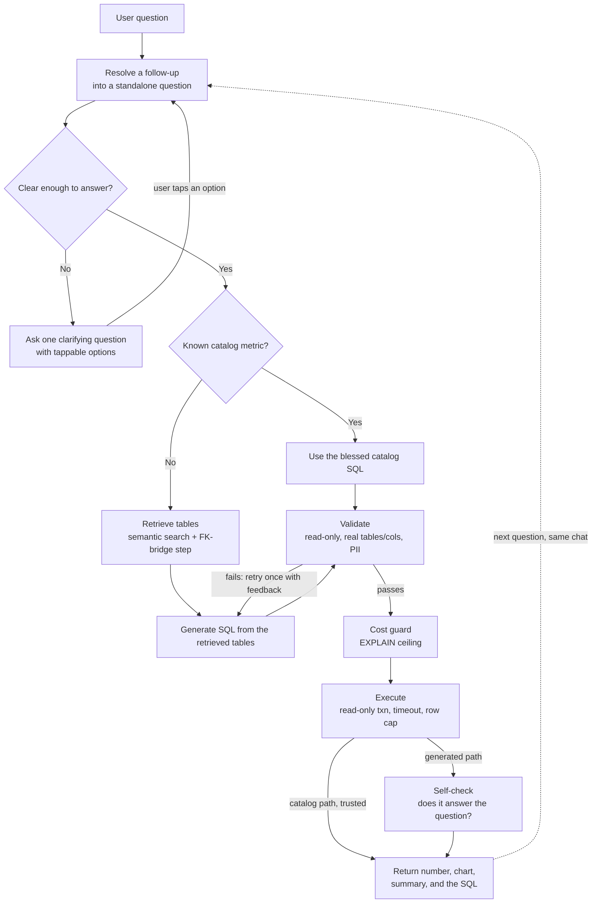

# InsightAgent

InsightAgent lets someone ask a question about a database in plain English and get back a real answer: the number, a chart when it helps, a one line summary, and the exact SQL it ran. If a question is too vague to answer correctly, it asks one clarifying question instead of guessing.

The database here is Pagila, the Postgres DVD rental sample. The database is not the point. The pipeline around it is.

## Why I built it

The people who need data the most, product and business managers, usually cannot get it themselves. They ask an analyst and wait. By the time the number comes back the decision has often already been made on instinct. The analyst, meanwhile, spends the day answering the same narrow questions instead of doing the work only they can do.

Dashboards do not close this gap. A dashboard answers the questions someone predicted when they built it. Everything else becomes a ticket: an arbitrary intersection, a one off question nobody will ask again, a before and after comparison around a specific date. InsightAgent writes the query for those on the spot.

## The one idea everything is built around

Never trust the model's output without a guard right behind it.

The language model is good at turning a question into SQL and at reading a result back. It is also fully capable of being confidently wrong. So every step that depends on the model is followed immediately by a check that does not:

- It writes SQL. A validator then rejects anything that is not a single read-only query over real tables and columns, and blocks PII columns it should not return.
- Before any query runs, a cost guard runs `EXPLAIN` and blocks queries whose estimated cost is absurd (an accidental cross join, for example).
- The query runs inside a read-only transaction with a timeout and a row cap, so even a query that slipped through cannot write or hang.
- After the answer comes back, a self check asks whether the result actually answers the question that was asked.

If you change anything, keep this shape. The model proposes, a guard disposes.

## How a question flows



Reading it:

- Resolve runs first, so "what about store 2?" becomes a full standalone question using the recent history before anything else touches it.
- A vague question is sent back to the user with one clarifying question and tappable options, not a guessed number. The tapped option re-enters at resolve.
- Known metrics (total revenue, active customers, average payment) use a fixed, human written SQL definition. That path skips retrieval, generation, and the self check, because a blessed definition does not need its correctness re-verified. It still goes through validation and execution so there is a single execution path.
- Everything else retrieves the relevant tables, generates SQL from only those, and gets self checked at the end.

## Retrieval, and the part that was not obvious

Retrieval picks which tables a question needs by comparing the question's embedding against a short description of each table. That works for the tables a question names. It fails for the tables in the middle of a join that the question never mentions. "Which film category made the most revenue?" needs the rental and inventory tables to connect payments to categories, but the question says neither word.

Semantic search alone kept missing those. So after the semantic step I added a deterministic one: look at the foreign key graph, and add a table only when it connects two otherwise disconnected pieces of what was already retrieved. That pulls in the bridge tables a question never names, and nothing else. The naive version, adding every foreign key neighbor, drags in half the schema, because tables like payment and customer touch everything.

That is the kind of problem the model cannot reliably fix on its own and structure can.

## Results, honestly

There is a hand written set of 12 questions where I verified the correct answer by hand first. The agent only sees the question. I measure two things separately: did retrieval fetch the tables the question needs, and did the final answer match the verified value.

Answer accuracy is 12 out of 12. Retrieval accuracy is 7 out of 8 (the three catalog questions skip retrieval, so they do not count toward it).

I am not going to dress up the 7 out of 8. On the "customers in California" question, retrieval ranks the `address` table tenth and drops it. The answer still comes out right, but for a reason I do not love: the model used the `address` table from its own knowledge of Pagila, and validation allowed it because validation checks that a table is real, not that retrieval surfaced it. So the answer is correct and retrieval is wrong at the same time, which is exactly why I measure them separately. If the data were shaped differently, that same question could have returned a wrong number.

And 12 questions is enough to catch hallucination. It is not enough to claim an accuracy number means much. I would not put "12/12" on a slide as if it were a benchmark.

## What is still open

- The retrieval miss above. I have not fixed it, because it does not currently produce a wrong answer, and the obvious fixes (raise k, hand tune the description) feel like fitting to one question rather than solving the real thing. I am not sure yet what the right general fix is.
- I let generation use any real table, not only the retrieved ones. That made one question correct that strict retrieval would have failed. It is a genuine trade-off, robustness against a cleaner guarantee, and I kept the looser version on purpose. I am not certain it is the right call at a larger scale.
- I looked at adding HyDE (generating a hypothetical answer to embed for retrieval). At 15 tables with a known foreign key graph it is not worth the extra model call, and it would not have fixed the join bridge problem anyway. I do not know where the schema gets large enough that it starts to pay off.
- It is a single-user prototype. No multi-tenancy, no per-user access control, no real memory beyond rewriting the last follow up.
- The rental data has gaps I did not expect: no rentals at all in January, March, or April, and the rental dates and payment dates do not line up. I had to build the time based questions around that rather than assume the data was clean. Worth knowing before trusting any time based answer.

## Stack

- Python (standard library for the API calls; no vendor SDKs)
- PostgreSQL with the Pagila sample database
- psycopg3 for the database, sqlglot for parsing and validating SQL
- Anthropic Claude for generation, the self check, routing, resolving, and clarifying
- Google Gemini embeddings for retrieval
- Streamlit for the UI
- pgvector was not available on this machine, so embeddings live in a normal Postgres array and cosine similarity is computed in Python. At a 15 row index it makes no difference, and at 3072 dimensions pgvector's index would not have applied anyway. The retrieval code is behind a small interface, so swapping pgvector back in later is a one file change.

## Running it

You need Postgres running with the Pagila database loaded, and a `.env` file with database and API credentials (see the placeholders the app expects: `DB_*`, `LLM_*`, `EMBEDDING_*`). The `.env` file is gitignored and is not in this repo.

```bash
pip install psycopg[binary] sqlglot streamlit pandas

# one time: embed the table descriptions into the schema index
python build_schema_index.py

# run the app
python -m streamlit run app.py

# run the full evaluation (all 12 questions through the live pipeline)
python eval_suite.py
```

Every module also runs on its own as a small smoke test, for example `python validation.py` runs a battery of read-only and PII checks, and `python retrieve.py` shows retrieval on an easy and a hard question.

## Repo layout

The build went one component at a time, each small and tested before moving on.

Offline (build the index once):
- `table_descriptions.py` plain language descriptions of the 15 tables
- `embedding.py` text to vector
- `build_schema_index.py` embeds the descriptions and stores them

Per question (the pipeline):
- `resolver.py`[insightagent/resolver.py] rewrites a follow up into a standalone question
- `clarify.py` decides if a question is too vague and produces tappable options
- `catalog.py` the blessed metric definitions and a strict router
- `retrieve.py` semantic retrieval plus the foreign key bridge step
- `generation.py` turns retrieved tables into one SELECT
- `validation.py` and `pii.py` the guard behind generation
- `cost.py` the EXPLAIN cost guard
- `execution.py` runs the query read-only with a timeout
- `selfcheck.py` checks the result against the question
- `pipeline.py` wires all of it together
- `summary.py` the one line answer for the UI
- `app.py` the Streamlit UI
- `eval_suite.py` the evaluation harness

`CLAUDE.md` has the full design notes, the data quirks, and the decisions, in more detail than this README.
