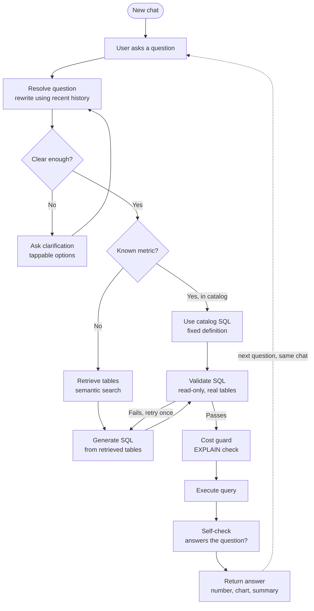

# Request Lifecycle



## How to read it

- **Solid arrows** are one question's journey through the pipeline.
- **The dashed arrow** is the conversation continuing: after an answer, the
  next question re-enters at the top, where the resolve step now has the longer
  history to work with.
- **Two loops guard the model's output.** The clarification loop sends a vague
  question back to the user before answering. The validation loop bounces
  failed SQL back to generation exactly once.
- **Catalog SQL skips retrieval and generation** (it's a trusted, fixed
  definition) but still flows through validation and execution for a single
  execution path. It skips the self-check, since a blessed definition does not
  need its correctness re-verified.
```
